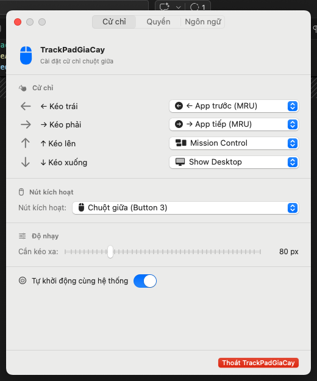
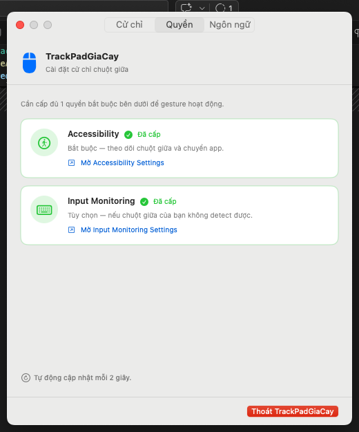
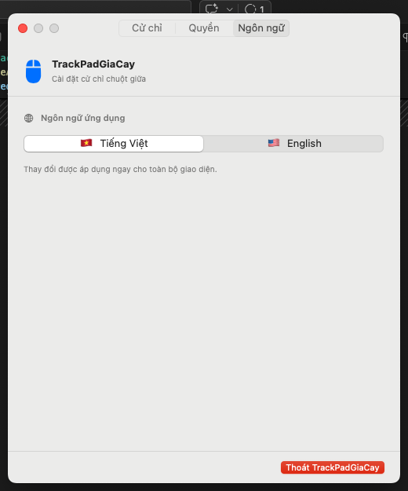

# 🖱️ TrackPadGiaCay

**EN** | [Tiếng Việt](#tiếng-việt)

A lightweight macOS menu bar utility that maps middle mouse button drag gestures to system actions — switch apps by MRU history, trigger Mission Control, Show Desktop, change Spaces, and more.

<p align="center">
  
  
  
</p>

---

## Features

| Gesture | Default Action | Configurable |
|---------|---------------|:---:|
| Hold middle button + drag ← | Switch to previous app (MRU) | ✅ |
| Hold middle button + drag → | Switch to next app (MRU) | ✅ |
| Hold middle button + drag ↑ | Mission Control | ✅ |
| Hold middle button + drag ↓ | Show Desktop | ✅ |

- **Configurable trigger button** — middle, side/back, side/forward, or any extra button
- **Adjustable sensitivity** — set the minimum drag distance
- **Visual overlay** — animated arrow indicator with boundary feedback
- **Multi-language UI** — English / Tiếng Việt
- **Launch at login** — runs silently in the menu bar
- **Universal binary** — native Apple Silicon (arm64) + Intel (x86_64)

---

## Requirements

- macOS 13 Ventura or later
- A mouse with a middle button (or configurable side buttons)

---

## Installation

### Option A — PKG Installer *(recommended, double-click)*

> ⚠️ TrackPadGiaCay is not signed with an Apple Developer ID. macOS Gatekeeper will warn you on first open. This is expected for open-source tools distributed outside the App Store.

1. Download **`TrackPadGiaCay-vX.X.pkg`** from [Releases](https://github.com/hule-prime/TrackPadTao/releases/latest)
2. **Right-click** the `.pkg` file → choose **Open**
   *(Do not double-click — Gatekeeper will block it. Right-click → Open bypasses this for trusted files.)*
3. In the dialog that appears, click **Open** to proceed
4. Follow the installer: **Continue → Install** → enter your macOS password
5. When installation completes, **System Settings → Privacy & Security → Accessibility** opens automatically
6. Click **+**, navigate to `/Applications/`, select **TrackPadGiaCay**, and toggle it **on**

Done — the app starts immediately and auto-launches on every login.

---

### Option B — ZIP *(manual install)*

1. Download **`TrackPadGiaCay-vX.X.zip`** from [Releases](https://github.com/hule-prime/TrackPadTao/releases/latest)
2. Unzip — you'll get `TrackPadGiaCay.app` and `install.sh`
3. Open **Terminal**, `cd` into the unzipped folder, then run:
   ```bash
   chmod +x install.sh && ./install.sh
   ```
4. The script installs the app to `~/Applications/`, sets up auto-launch, and opens Accessibility Settings for you
5. Grant **Accessibility** permission as prompted

---

## First-run Permission

TrackPadGiaCay requires one permission to function:

| Permission | Why | Required |
|------------|-----|:--------:|
| **Accessibility** | Monitors mouse button events and switches apps | ✅ Yes |
| Input Monitoring | Fallback if middle button is not detected | Optional |

The app will guide you to grant Accessibility on first launch. You only need to do this once per installation.

---

## Usage

Once running, a mouse icon (🖱) appears in your menu bar.

- **Click** the icon to open Settings
- **Drag** with the configured button held down to trigger gestures
- Configure each direction, the trigger button, and drag sensitivity in **Settings → Gestures**
- Switch language in **Settings → Language**

---

## Uninstall

```bash
launchctl unload ~/Library/LaunchAgents/com.w3leee.TrackPadGiaCay.plist
rm -rf ~/Applications/TrackPadGiaCay.app
rm ~/Library/LaunchAgents/com.w3leee.TrackPadGiaCay.plist
```

---

## Build from Source

Requires Xcode Command Line Tools and Swift 5.9+.

```bash
git clone https://github.com/hule-prime/TrackPadTao.git
cd TrackPadTao
./make_app.sh        # build + deploy to ~/Desktop/TrackPadGiaCay.app
# or
./make_pkg.sh        # build distributable .pkg installer
```

---

## License

MIT — free to use, modify, and distribute.

---

---

# Tiếng Việt

**[English](#️-trackpadgiacay)** | **VI**

Tiện ích menu bar macOS nhỏ gọn, ánh xạ cử chỉ kéo chuột giữa thành các thao tác hệ thống — chuyển app theo lịch sử MRU, Mission Control, Show Desktop, chuyển Space, và nhiều hơn nữa.

<p align="center">
  
  
  
</p>

---

## Tính năng

| Cử chỉ | Mặc định | Có thể đổi |
|--------|---------|:---:|
| Giữ chuột giữa + kéo ← | Chuyển app trước (MRU) | ✅ |
| Giữ chuột giữa + kéo → | Chuyển app tiếp (MRU) | ✅ |
| Giữ chuột giữa + kéo ↑ | Mission Control | ✅ |
| Giữ chuột giữa + kéo ↓ | Show Desktop | ✅ |

- **Nút kích hoạt tùy chỉnh** — chuột giữa, nút hông trái/phải, hoặc bất kỳ nút phụ nào
- **Độ nhạy điều chỉnh được** — cài khoảng cách kéo tối thiểu
- **Overlay animation** — hiển thị mũi tên với phản hồi biên giới
- **Giao diện 2 ngôn ngữ** — Tiếng Việt / English
- **Tự khởi động cùng hệ thống**
- **Universal binary** — Apple Silicon (arm64) + Intel (x86_64)

---

## Yêu cầu

- macOS 13 Ventura trở lên
- Chuột có nút giữa (hoặc nút hông cấu hình được)

---

## Cài đặt

### Cách A — PKG Installer *(khuyến nghị, double-click)*

> ⚠️ TrackPadGiaCay chưa được ký bằng Apple Developer ID. macOS Gatekeeper sẽ cảnh báo khi mở lần đầu. Đây là bình thường với các tool mã nguồn mở phân phối ngoài App Store.

1. Tải **`TrackPadGiaCay-vX.X.pkg`** từ [Releases](https://github.com/hule-prime/TrackPadTao/releases/latest)
2. **Right-click** (hoặc Control+click) vào file `.pkg` → chọn **Open**
   *(Không double-click — Gatekeeper sẽ chặn. Right-click → Open sẽ bỏ qua cảnh báo này.)*
3. Trong hộp thoại hiện ra, nhấn **Open** để tiếp tục
4. Làm theo trình cài đặt: **Continue → Install** → nhập mật khẩu macOS
5. Khi cài xong, **System Settings → Privacy & Security → Accessibility** tự động mở
6. Nhấn **+**, chọn **TrackPadGiaCay** từ `/Applications/`, bật toggle

Xong — app khởi động ngay và tự chạy mỗi lần đăng nhập.

---

### Cách B — ZIP *(cài thủ công qua Terminal)*

1. Tải **`TrackPadGiaCay-vX.X.zip`** từ [Releases](https://github.com/hule-prime/TrackPadTao/releases/latest)
2. Giải nén — bạn sẽ có `TrackPadGiaCay.app` và `install.sh`
3. Mở **Terminal**, `cd` vào thư mục vừa giải nén, chạy:
   ```bash
   chmod +x install.sh && ./install.sh
   ```
4. Script tự cài app vào `~/Applications/`, cấu hình auto-launch, và mở Accessibility Settings
5. Cấp quyền **Accessibility** khi được yêu cầu

---

## Quyền cần thiết

| Quyền | Mục đích | Bắt buộc |
|-------|---------|:--------:|
| **Accessibility** | Theo dõi sự kiện chuột và chuyển app | ✅ Có |
| Input Monitoring | Dự phòng nếu chuột giữa không được nhận diện | Tùy chọn |

App sẽ hướng dẫn bạn cấp quyền Accessibility ngay lần đầu khởi động. Chỉ cần làm một lần duy nhất.

---

## Sử dụng

Sau khi chạy, icon chuột 🖱 xuất hiện trên menu bar.

- **Click** icon để mở Settings
- **Kéo** chuột trong khi giữ nút đã cấu hình để kích hoạt cử chỉ
- Cấu hình từng hướng kéo, nút kích hoạt và độ nhạy trong **Settings → Cử chỉ**
- Đổi ngôn ngữ trong **Settings → Ngôn ngữ**

---

## Gỡ cài đặt

```bash
launchctl unload ~/Library/LaunchAgents/com.w3leee.TrackPadGiaCay.plist
rm -rf ~/Applications/TrackPadGiaCay.app
rm ~/Library/LaunchAgents/com.w3leee.TrackPadGiaCay.plist
```

---

## Build từ source

Yêu cầu Xcode Command Line Tools và Swift 5.9+.

```bash
git clone https://github.com/hule-prime/TrackPadTao.git
cd TrackPadTao
./make_app.sh        # build + deploy vào ~/Desktop/TrackPadGiaCay.app
# hoặc
./make_pkg.sh        # build file .pkg phân phối
```
